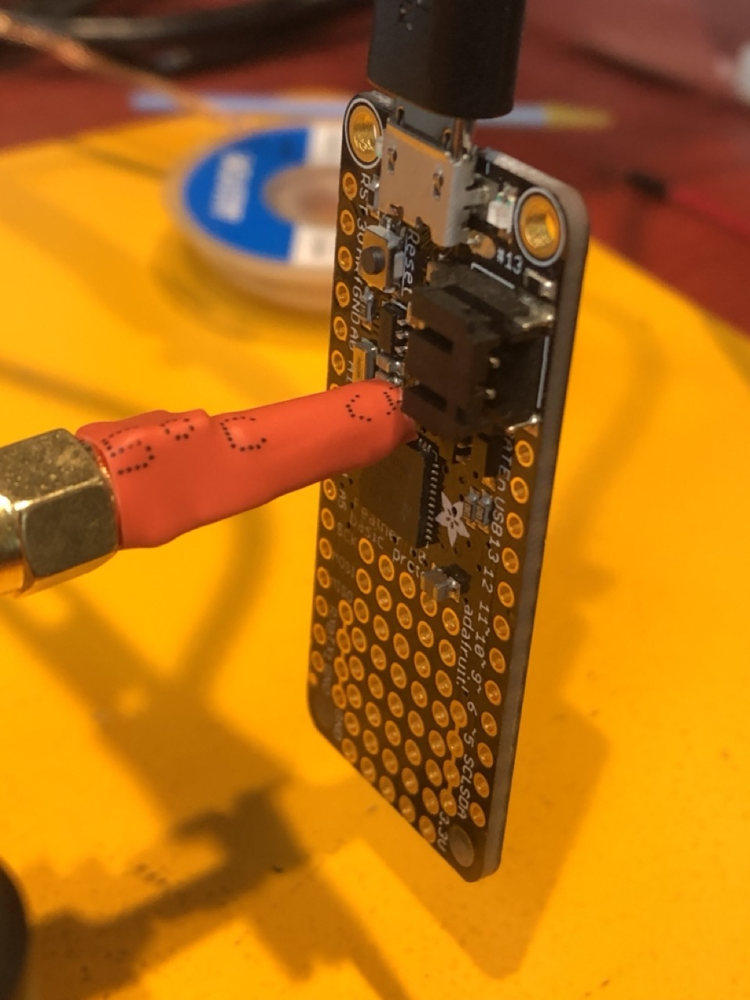
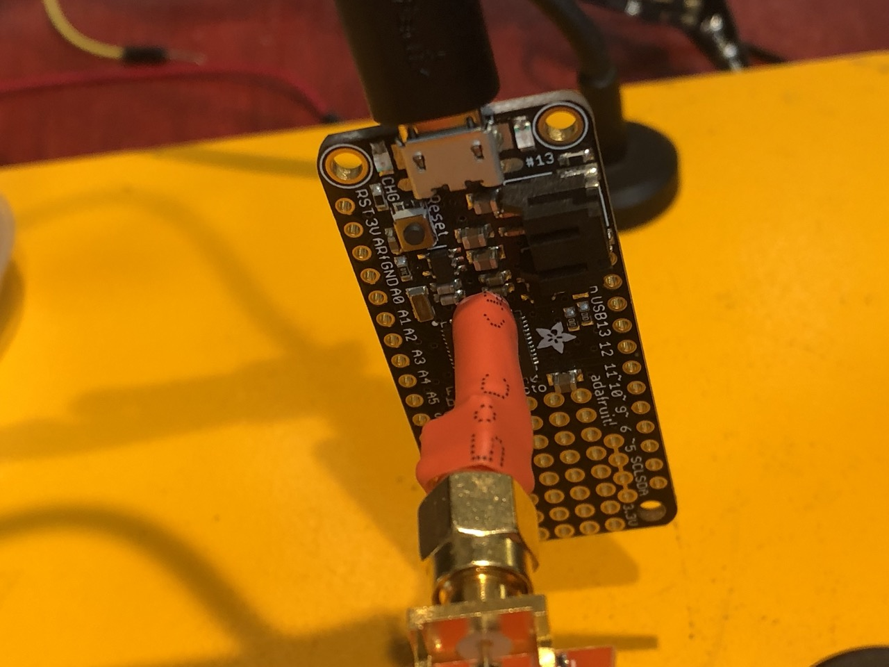

# Adafruit Feather M0 Basic

This is target Arduino Code for the Adafruit M0 Board for use with the [PicoEMP](https://github.com/newaetech/chipshouter-picoemp) tool.

[Adafruit M0 Basic Proto Board](https://learn.adafruit.com/adafruit-feather-m0-basic-proto/overview)

To get this to work, upload the c code to the RPi Pico 2040 - this [firmware](https://github.com/newaetech/chipshouter-picoemp/tree/main/firmware/c), then open the serial port, and set the timing from 5 to 1ns. I found that with 5ns it tends to reset the entire chip, and not just the current loops.

The location on the board/cpu to target is the side of the chip closest to the clock crystal. After playing with it a few times (like 40 or 50 attempts), I was finally able to get the chip to glitch successfully. This is very much an art, and not a science yet.

The code here can be pasted into Arduino, and directly uploaded to the Adafruit Feather M0.

If you glitch it right, it will give you the output on the serial, and blink the LED.

Have fun! 

## Location of the glitch

## License

This work is licensed under a [Creative Commons Attribution-ShareAlike 3.0 International License][cc-by-sa].

[cc-by-sa]: http://creativecommons.org/licenses/by-sa/3.0/
[cc-by-sa-image]: https://licensebuttons.net/l/by-sa/3.0/88x31.png
[cc-by-sa-shield]: https://img.shields.io/badge/License-CC%20BY--SA%203.0-lightgrey.svg
